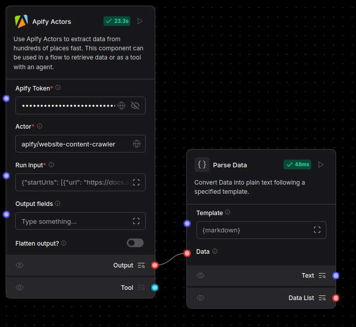
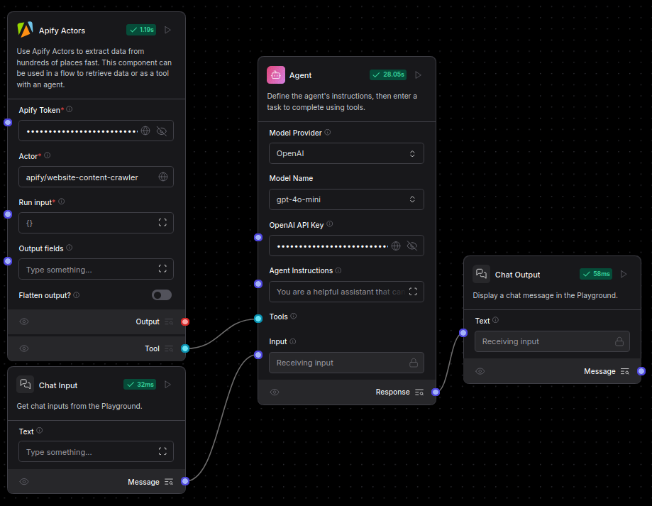
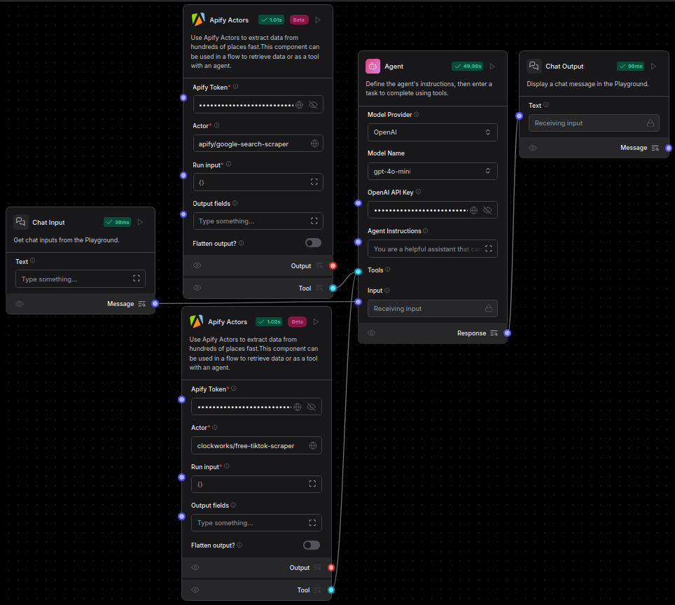

import Icon from "@site/src/components/icon";

[Apify](https://apify.com/) 是一个网站抓取和数据提取平台，拥有超过 3,000 个现成的云工具，称为 **Actors**。

您的流程可以使用 **Apify Actors** 组件来运行 **Actors**，以完成数据提取、内容分析和 SQL 操作等任务。

## 在流程中使用 Apify Actors 组件

1. 将 **Apify Actors** 组件添加到您的流程中，然后按如下方式配置：

    * **Apify Token**：输入您的 [Apify API token](https://docs.apify.com/platform/integrations/api)。
    * **Actor**：输入您希望从 [Apify Actor Store](https://apify.com/store) 运行的 Actor ID。例如，[Website Content Crawler](https://apify.com/apify/website-content-crawler) 的 Actor ID 为 `apify/website-content-crawler`。
    * **Run Input**：输入用于配置 Actor 运行的 [JSON 输入](https://docs.apify.com/platform/actors/running-actors#input)。
    * 根据您选择的 Actor 和用例配置其他参数和命令。

2. 将组件连接到流程中的其他组件。
该组件可以用作流程中的独立步骤或作为智能体的工具来执行任务。

    要为该组件启用工具模式，请将组件的输出类型从**输出**更改为**工具**，然后将其连接到**智能体**组件上的**工具**端口。

    **Apify Actors** 组件将 Actor 运行的结果作为 JSON 对象以 Langflow 的 [`Data` 类型](/data-types#data)输出。

## Apify Actors 流程示例

以下场景提供了一些在 Langflow 中使用 **Apify Actors** 组件的示例：

* **提取网站文本内容为 Markdown 格式**：使用 [Website Content Crawler Actor](https://apify.com/apify/website-content-crawler) 从网站中提取 Markdown 格式的文本内容，然后将**输出**连接到**解析器**组件的输入以进行进一步处理。

    

* **使用智能体处理网站内容**：将 [Website Content Crawler Actor](https://apify.com/apify/website-content-crawler) 作为工具附加到**智能体**组件，以便智能体可以根据聊天输入决定是否提取网站内容。智能体可以获取提取的数据并将其转换为摘要、洞察或结构化响应，以使信息更具可操作性。

    

* **使用多个 Actor 分析社交媒体资料**：使用多个 Apify Actors 进行全面的社交媒体研究：

    * 使用 [Google Search Results Scraper Actor](https://apify.com/apify/google-search-scraper) 查找相关的社交媒体资料。
    * 使用 [TikTok Data Extractor Actor](https://apify.com/clockworks/free-tiktok-scraper) 收集数据和视频。
    * 将两个 Actor 都作为**智能体**组件的工具，以从 Google 收集链接和从 TikTok 收集内容，然后分析数据以提供关于个人、品牌或主题的洞察。

    