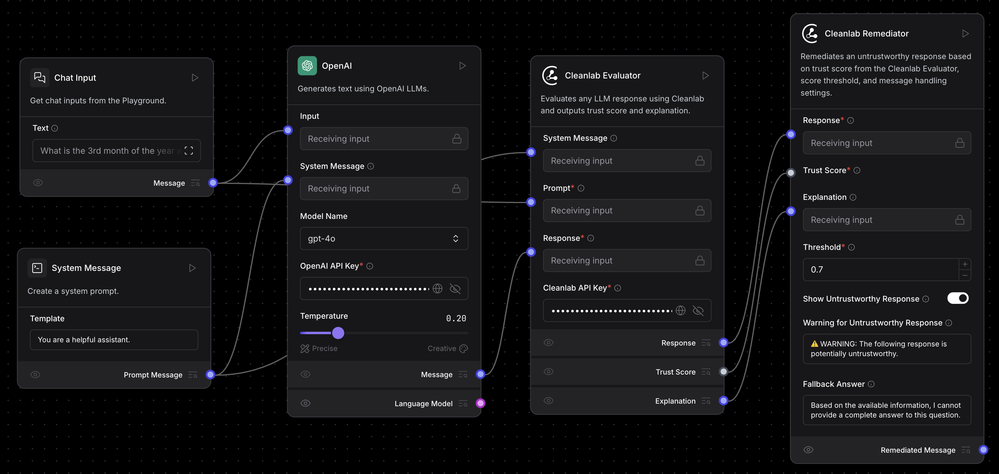
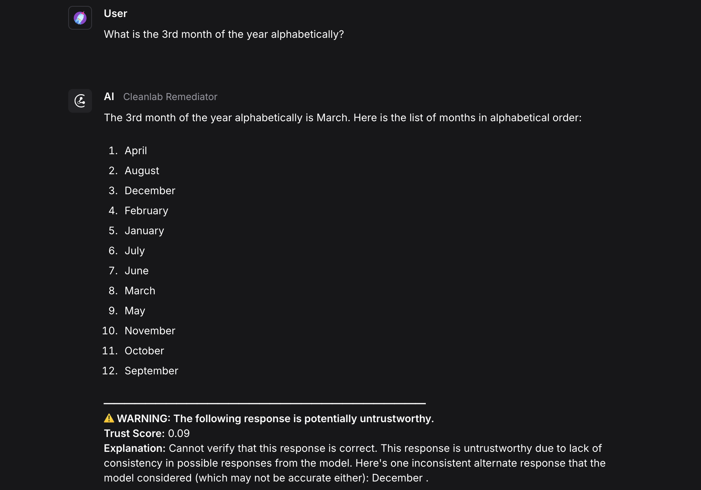
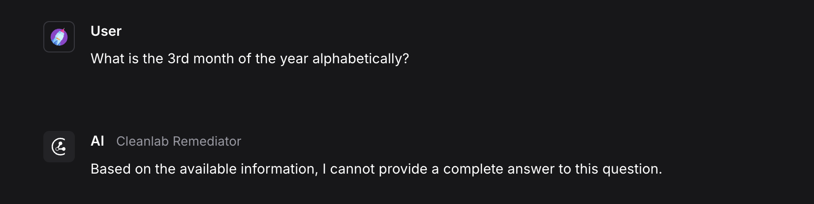
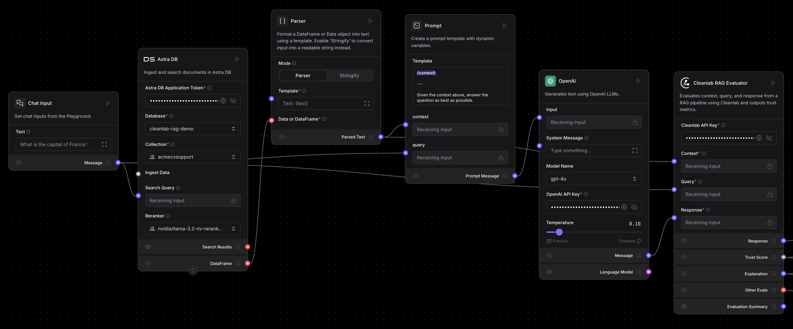
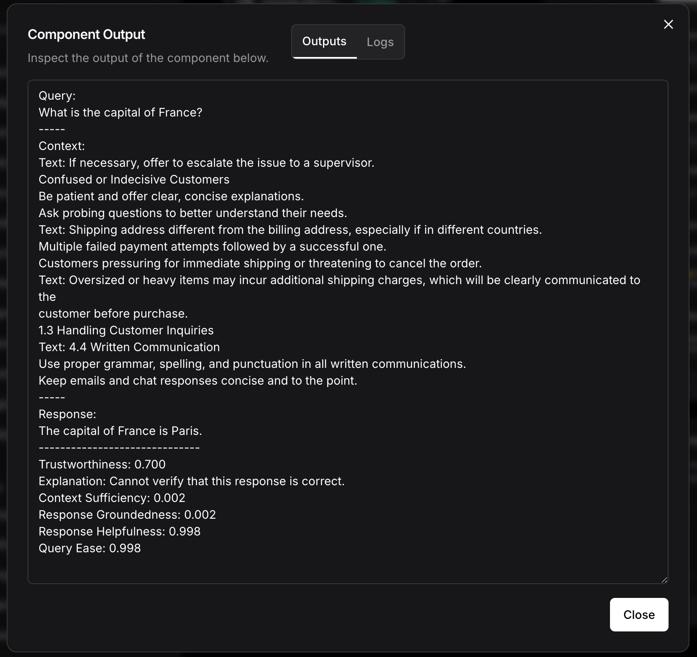

import Icon from "@site/src/components/icon";

[Cleanlab](https://www.cleanlab.ai/) 为 AI 和 RAG 解决方案中输入的每个数据点和输出的每个预测增加了自动化和信任度。

使用 Cleanlab 组件将 Cleanlab 评估与 Langflow 集成，通过 Cleanlab 的评估和修复套件解锁值得信赖的智能体、RAG 和 LLM 管道。

您可以使用这些组件用 `0` 到 `1` 之间的分数量化任何 LLM 响应的可信度，并解释为什么响应可能是好的或坏的。对于带有上下文的 RAG/智能体管道，您可以通过定量分数评估上下文充分性、事实依据、有用性和查询清晰度。此外，您可以通过警告或后备答案修复低信任度的响应。

需要使用 Cleanlab API 密钥进行身份验证。

## Cleanlab 评估器

**Cleanlab 评估器**组件使用 Cleanlab 评估和解释提示和响应对的可信度。有关分数工作原理的更多信息，请参阅 [Cleanlab 文档](https://help.cleanlab.ai/tlm/)。

### Cleanlab 评估器参数

某些 **Cleanlab 评估器**组件输入参数在可视化编辑器中默认隐藏。
您可以通过[组件标题菜单](/concepts-components#component-menus)中的<Icon name="SlidersHorizontal" aria-hidden="true"/> **控制**切换参数。

| 名称                    | 类型       | 描述                        |
|-------------------------|------------|------------------------------------|
| system_prompt           | Message    | 输入参数。预置到提示前的系统消息。可选。 |
| prompt                  | Message    | 输入参数。用户面向的 LLM 输入。  |
| response                | Message    | 输入参数。要评估的模型响应。    |
| cleanlab_api_key        | Secret     | 输入参数。您的 Cleanlab API 密钥。  |
| cleanlab_evaluation_model | Dropdown   | 输入参数。Cleanlab 使用的评估模型，如 GPT-4 或 Claude。这不需要与生成响应的模型相同。 |
| quality_preset          | Dropdown   | 输入参数。评估速度和准确性之间的权衡。 |

### Cleanlab 评估器输出

**Cleanlab 评估器**组件有三个可能的输出。

| 名称                    | 类型       | 描述            |
|-------------------------|------------|-------------------------|
| score                   | number, float | 显示 0 到 1 之间的信任分数。  |
| explanation             | `Message`    | 提供信任分数的解释。 |
| response                | `Message`    | 返回原始响应，便于链接到 **Cleanlab 修复器**组件。 |

## Cleanlab 修复器

**Cleanlab 修复器**组件使用来自 [**Cleanlab 评估器**组件](#cleanlab-evaluator) 的信任分数来决定是否显示、警告或替换 LLM 响应。

该组件具有分数阈值、警告文本和后备消息的参数，您可以根据需要进行自定义。

输出是 **修复响应** (`remediated_response`)，这是一个包含应用修复逻辑后向用户显示的最终消息的 `Message`。

### Cleanlab 修复器参数

| 名称                        | 类型       | 描述 |
|-----------------------------|------------|---------|
| response                    | Message    | 输入参数。要可能修复的响应。  |
| score                       | Number     | 输入参数。来自 `CleanlabEvaluator` 的信任分数。 |
| explanation                 | Message    | 输入参数。如果显示警告则附加的解释。可选。|
| threshold                   | Float      | 输入参数。不变传递响应的最小信任分数。  |
| show_untrustworthy_response | Boolean      | 输入参数。如果响应被认为不可信，是否显示或隐藏带有警告的原始响应。 |
| untrustworthy_warning_text  | Prompt     | 输入参数。不可信响应的警告文本。 |
| fallback_text              | Prompt     | 输入参数。如果隐藏响应的后备消息。 |

## Cleanlab RAG 评估器

**Cleanlab RAG 评估器**组件使用 [Cleanlab 的评估指标](https://help.cleanlab.ai/tlm/use-cases/tlm_rag/) 评估 RAG 和 LLM 管道输出的可信度、上下文充分性、响应事实依据、有用性和查询简易性。

您可以将此组件与 [**Cleanlab 修复器**组件](#cleanlab-remediator) 配对，以修复来自 RAG 管道的低信任度响应。

### Cleanlab RAG 评估器参数

某些 **Cleanlab RAG 评估器**组件输入参数在可视化编辑器中默认隐藏。
您可以通过[组件标题菜单](/concepts-components#component-menus)中的<Icon name="SlidersHorizontal" aria-hidden="true"/> **控制**切换参数。

| 名称                        | 类型       | 描述 |
|-----------------------------|------------|------------|
| cleanlab_api_key           | Secret     | 输入参数。您的 Cleanlab API 密钥。    |
| cleanlab_evaluation_model  | Dropdown   | 输入参数。Cleanlab 使用的评估模型，如 GPT-4 或 Claude。这不需要与生成响应的模型相同。 |
| quality_preset             | Dropdown   | 输入参数。评估速度和准确性之间的权衡。  |
| context                    | Message    | 输入参数。从您的 RAG 系统检索的上下文。   |
| query                      | Message    | 输入参数。原始用户查询。   |
| response                   | Message    | 输入参数。基于上下文和查询的模型响应。 |
| run_context_sufficiency    | Boolean      | 输入参数。评估上下文是否支持回答查询。  |
| run_response_groundedness  | Boolean      | 输入参数。评估响应是否基于上下文。 |
| run_response_helpfulness   | Boolean      | 输入参数。评估响应的有用程度。  |
| run_query_ease            | Boolean      | 输入参数。评估查询是否模糊、复杂或对抗性。 |

### Cleanlab RAG 评估器输出

**Cleanlab RAG 评估器**组件具有以下输出选项：

| 名称               | 类型       | 描述              |
|--------------------|------------|--------------------------|
| trust_score        | Number     | 整体信任分数。 |
| trust_explanation  | Message    | 信任分数的解释。 |
| other_scores       | Dictionary | 可选启用的 RAG 评估指标字典。 |
| evaluation_summary | Message    | 查询、上下文、响应和评估结果的 Markdown 摘要。 |
| response           | Message    | 返回原始响应，便于链接到 **Cleanlab 修复器**组件。 |

## 示例 Cleanlab 流程

以下示例流程展示了如何使用 **CleanlabEvaluator** 和 **CleanlabRemediator** 组件来评估和修复来自任何 LLM 的响应，以及如何使用 `CleanlabRAGEvaluator` 组件来评估 RAG 管道输出。

### 评估和修复来自 LLM 的响应

:::tip
您可以[下载评估和修复流程](./eval_and_remediate_cleanlab.json)，然后将其导入到您的 Langflow 实例中进行跟进。
:::

此流程使用 **CleanlabEvaluator** 和 **CleanlabRemediator** 组件评估和修复来自任何 LLM 的响应的可信度。

连接任何 LLM 组件的 `Message` 输出到 **CleanlabEvaluator** 组件的 `response` 输入，然后连接 Prompt 组件到其 `prompt` 输入。

**CleanlabEvaluator** 组件从流程中返回信任分数和解释。

**CleanlabRemediator** 组件使用此信任分数来决定是否输出原始响应、警告或用后备答案替换它。

此示例显示了一个被确定为不可信（分数为 `.09`）并被 **CleanlabRemediator** 组件标记警告的响应。

要隐藏不可信的响应，请配置 **CleanlabRemediator** 组件用后备消息替换响应。

### 评估 RAG 管道

此示例流程包括添加了 **CleanlabRAGEvaluator** 组件的 [Vector Store RAG](/vector-store-rag) 模板，用于评估流程的上下文、查询和响应。

要在流程中使用 **CleanlabRAGEvaluator** 组件，请将任何 RAG 管道的 `context`、`query` 和 `response` 输出连接到 **CleanlabRAGEvaluator** 组件。

这是来自 **CleanlabRAGEvaluator** 组件的 `Evaluation Summary` 输出的示例。

`Evaluation Summary` 包括查询、上下文、响应和所有评估结果。在此示例中，`Context Sufficiency` 和 `Response Groundedness` 分数很低（分数为 `0.002`），因为上下文不包含有关查询的信息，并且响应不基于上下文。