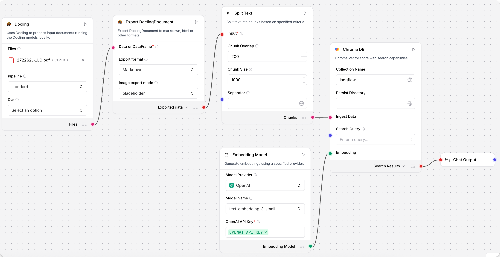

import Tabs from '@theme/Tabs';
import TabItem from '@theme/TabItem';
import Icon from "@site/src/components/icon";

Langflow 通过一组用于解析文档的组件与 [Docling](https://docling-project.github.io/docling/) 集成。

## 安装 Docling 依赖项

:::important
您必须安装 Docling 依赖项才能在 Langflow 中使用 Docling 组件。
:::

在 Langflow OSS 中使用 `uv pip install 'langflow[docling]'` 安装 Docling 额外包。

要向 Langflow Desktop 添加依赖项，请在应用程序的 `requirements.txt` 文件中添加 Docling 条目。
有关更多信息，请参阅[在 Langflow Desktop 中安装自定义依赖项](/install-custom-dependencies#langflow-desktop)。

## 在流程中使用 Docling 组件

:::tip
要了解更多关于使用 Docling 进行内容提取的信息，请观看视频教程 [Docling + Langflow: Document Processing for AI Workflows](https://www.youtube.com/watch?v=5DuS6uRI5OM)。
:::

此示例演示如何在流程中使用 Docling 组件分割 PDF：

1. 将 **Docling** 和 **ExportDoclingDocument** 组件连接到 [**Split Text**](/components-processing#split-text) 组件。
    **Docling** 组件加载文档，**ExportDoclingDocument** 组件将 DoclingDocument 转换为您选择的格式。此示例将文档转换为 Markdown，图像表示为占位符。
    **Split Text** 组件将 Markdown 分割成块，供向量数据库在流程的下一部分中存储。
2. 将 [**Chroma DB**](/components-vector-stores#chroma-db) 组件连接到 **Split text** 组件的 **Chunks** 输出。
3. 将[**嵌入模型**](/components-embedding-models)连接到 Chroma 的 **Embedding** 端口，并连接 **Chat Output** 组件以查看提取的 [DataFrame](/data-types#dataframe)。
4. 将您的 OpenAI API 密钥添加到嵌入模型。

流程如下所示：

5. 向 **Docling** 组件添加文件。
6. 要运行流程，点击<Icon name="Play" aria-hidden="true"/> **Playground**。
    分块文档作为向量加载到您的向量数据库中。

## Docling 组件

以下部分描述了 Docling bundle 中每个组件的目的和配置选项。

### Docling

**Docling** 组件摄取文档，然后使用 Docling 通过在本地运行 Docling 模型来处理它们。

它输出 `files`，这是带有 `DoclingDocument` 数据的处理文件。

#### Docling 参数

| 名称 | 类型 | 描述 |
|------|------|-------------|
| files | File | 要处理的文件。 |
| pipeline | String | 要使用的 Docling 管道（standard、vlm）。 |
| ocr_engine | String | 要使用的 OCR 引擎（easyocr、tesserocr、rapidocr、ocrmac）。 |

### Docling Serve

**Docling Serve** 组件摄取文档，然后通过连接到您的 Docling Serve 实例使用 Docling 来处理它们。

它输出 `files`，这是带有 `DoclingDocument` 数据的处理文件。

#### Docling Serve 参数

| 名称 | 类型 | 描述 |
|------|------|-------------|
| files | File | 要处理的文件。 |
| api_url | String | Docling Serve 实例的 URL。 |
| max_concurrency | Integer | 服务器的最大并发请求数。 |
| max_poll_timeout | Float | 文档转换完成的最大等待时间。 |
| api_headers | Dict | 连接到 Docling Serve 所需的其他请求头的可选字典。 |
| docling_serve_opts | Dict | Docling Serve 的其他选项的可选字典。 |

### Chunk DoclingDocument

**Chunk DoclingDocument** 组件使用 `DoclingDocument` 分块器将文档分割成块。

它将分块文档输出为 [`DataFrame`](/data-types#dataframe)。

#### Chunk DoclingDocument 参数

| 名称 | 类型 | 描述 |
|------|------|-------------|
| data_inputs | Data/DataFrame | 包含要分割成块的文档的数据。 |
| chunker | String | 要使用的分块器（HybridChunker、HierarchicalChunker）。 |
| provider | String | 分词器提供商（Hugging Face、OpenAI）。 |
| hf_model_name | String | 选择 Hugging Face 时与 HybridChunker 一起使用的分词器的模型名称。 |
| openai_model_name | String | 选择 OpenAI 时与 HybridChunker 一起使用的分词器的模型名称。 |
| max_tokens | Integer | HybridChunker 的最大令牌数。 |
| doc_key | String | 用于 DoclingDocument 列的键。 |

### Export DoclingDocument

**Export DoclingDocument** 组件将 `DoclingDocument` 导出为 Markdown、HTML 和其他格式。

它可以将导出的数据输出为 [`Data`](/data-types#data) 或 [`DataFrame`](/data-types#dataframe)。

#### Export DoclingDocument 参数

| 名称 | 类型 | 描述 |
|------|------|-------------|
| data_inputs | Data/DataFrame | 包含要导出的文档的数据。 |
| export_format | String | 选择导出格式来转换输入（Markdown、HTML、Plaintext、DocTags）。 |
| image_mode | String | 指定如何在输出中导出图像（placeholder、embedded）。 |
| md_image_placeholder | String | 为 markdown 导出指定图像占位符。 |
| md_page_break_placeholder | String | 在 markdown 输出中在页面之间添加此占位符。 |
| doc_key | String | 用于 DoclingDocument 列的键。 |