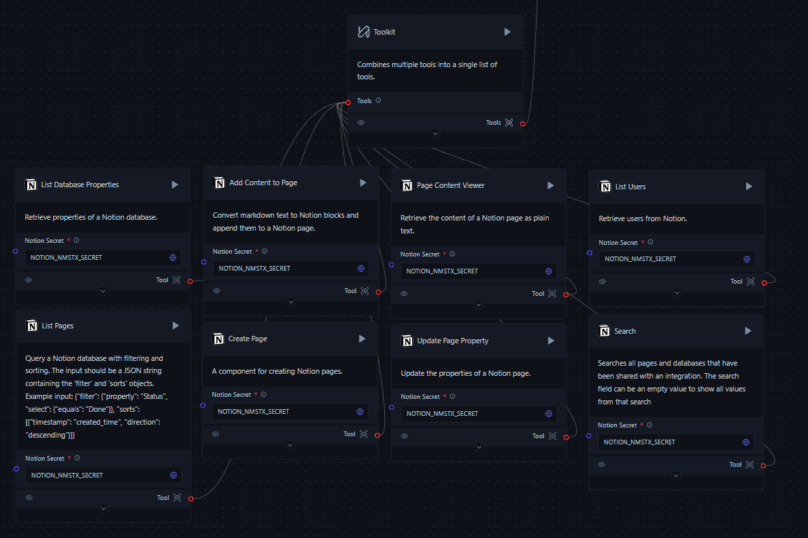

Notion 对话式代理是一个 AI 驱动的助手，通过自然语言对话与您的 Notion 工作区交互。此流程执行与 Notion 相关的任务，如创建页面、搜索信息和管理内容，全部通过聊天界面完成。



## 先决条件

- [Notion 应用](/integrations/notion/setup)
- [Notion 账户和 API 密钥](https://www.notion.so/my-integrations)
- [OpenAI API 密钥](https://platform.openai.com/account/api-keys)
- [下载流对话代理流](./Conversational_Notion_Agent.json)（下载链接）

## 组件

- **Chat Input**：接受用户查询和命令
- **Chat Output**：显示代理的响应
- **Language Model**：使用 OpenAI 模型处理用户输入并生成响应
- **Tool Calling Agent**：根据用户输入协调使用各种 Notion 工具
- **Toolkit**：将多个 Notion 特定工具组合成一个工具包
- **Notion Tools**：用于与 Notion 交互的各种组件，包括：
  - 列出用户
  - 列出数据库属性
  - 列出页面
  - 页面内容查看器
  - 创建页面
  - 更新页面属性
  - 向页面添加内容
  - 搜索
- **Message History**：存储对话历史
- **Prompt Template**：为代理提供系统指令和上下文
- **Current Date**：提供当前日期和时间以供上下文使用

## 运行 Notion 对话式代理

1. 打开 Langflow 并创建一个新流程。
2. 将上述组件添加到您的流程画布中，或下载 [对话代理流](./Conversational_Notion_Agent.json)（下载链接）并将 JSON 文件**导入**到 Langflow 中。
3. 按流程图所示连接组件。
4. 在各自的组件中输入 Notion 和 OpenAI API 密钥。
5. 要启动流程，请在 Langflow 中点击“播放”按钮。
6. 在聊天界面中，输入与 Notion 相关的请求或问题。例如：
   - “在我的任务数据库中创建一个新页面”
   - “搜索关于项目管理的页面”
   - “列出我的 Notion 工作区中的所有用户”
7. 代理将处理您的请求，使用适当的 Notion 工具，并提供响应。
8. 继续对话，根据需要提出后续问题或给出新命令。

## 交互示例

```
用户：列出我的 Notion 工作区中的所有用户。

代理：当然！我会使用 Notion 用户列表工具为您检索该信息。请稍等。

[代理使用 Notion 用户列表工具]

以下是您的 Notion 工作区中的用户列表：

1. John Doe (john@example.com)
2. Jane Smith (jane@example.com)
3. Alex Johnson (alex@example.com)

关于这些用户，您想了解什么特定信息吗？或者我可以帮您处理其他与 Notion 相关的任务吗？

用户：在我的项目数据库中创建一个标题为“网站重设计”的新页面。

代理：当然！我很乐意在您的项目数据库中创建一个标题为“网站重设计”的新页面。我将使用 Notion 页面创建器工具来完成此操作。首先，让我检查您的项目数据库的属性，以确保我们包含所有必要信息。

[代理使用 Notion 数据库属性工具]

我已检索到您的项目数据库的属性。现在，我将创建标题为“网站重设计”的新页面。请稍等。

[代理使用 Notion 页面创建器工具]

好消息！我已成功在您的项目数据库中创建了一个标题为“网站重设计”的新页面。以下是详细信息：

- 标题：网站重设计
- 页面 ID：[page_id_here]
- URL：[page_url_here]

您希望我在这个新项目页面中添加任何其他信息吗，比如描述、截止日期或分配的团队成员？

用户：是的，请添加一个描述：“重新设计公司网站以改善用户体验并现代化外观。”

代理：当然！我很乐意在“网站重设计”项目页面中添加该描述。我将使用“向页面添加内容”工具来更新页面信息。

[代理使用“向页面添加内容”工具]

我已成功在您的“网站重设计”项目页面中添加了描述。以下是我所做操作的摘要：

1. 使用我们之前交互中的页面 ID 定位了“网站重设计”页面。
2. 在页面中添加了以下内容：

   描述：重新设计公司网站以改善用户体验并现代化外观。

该描述已作为新文本块添加到页面中。您还希望我在这个项目页面中添加或修改其他内容吗？
```

## 自定义

可以自定义流程以满足您团队的特定需求。
例如：

1. 调整系统提示以改变代理的行为或知识库。
2. 根据您的特定需求添加或删除 Notion 工具。
3. 修改 OpenAI 模型参数（例如，温度）以调整代理的响应风格。

## 故障排除

如果您遇到问题：

1. 确保所有 API 密钥都正确设置并具有必要的权限。
2. 检查您的 Notion 集成是否可以访问相关页面和数据库。
3. 验证流程中的所有组件都正确连接。
4. 查看 Langflow 日志以获取任何错误消息。

有关更高级的使用和集成选项，请参阅 [Notion API 文档](https://developers.notion.com/) 和 [Langflow 文档](/)。