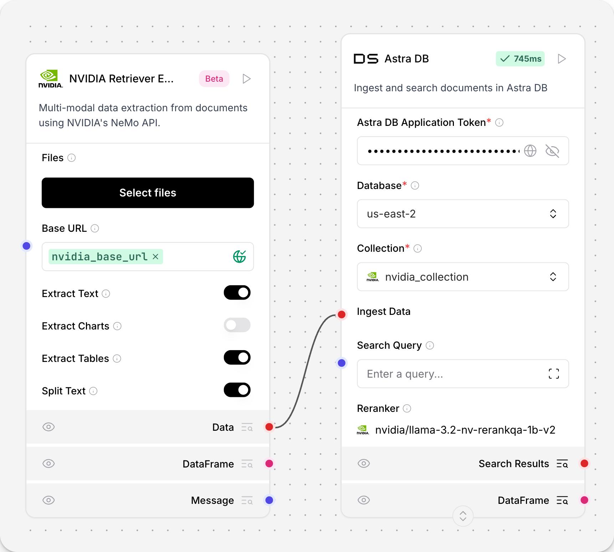

:::note
NVIDIA Retriever Extraction 也被称为 NV-Ingest 和 NeMo Retriever Extraction。
:::

**NVIDIA Retriever Extraction** 组件与 [NVIDIA nv-ingest](https://github.com/NVIDIA/nv-ingest) 微服务集成，用于数据接入、处理和提取文本文件。

`nv-ingest` 服务支持 PDF、DOCX 和 PPTX 文件类型的多种提取方法，并包括预处理和后处理服务，如分割、分块和嵌入生成。提取器服务的高分辨率模式使用 `nemoretriever-parse` 提取方法，从扫描的 PDF 文档中获得更高质量的提取。此功能仅适用于 PDF 文件。

**NVIDIA Retriever Extraction** 组件导入 NVIDIA `Ingestor` 客户端，通过请求 NVIDIA 接入端点来接入文件，并将处理后的内容作为 [Data](/data-types#data) 对象列表输出。`Ingestor` 接受用于从其他文本格式提取数据的其他配置选项。要配置这些选项，请参阅[组件参数](/integrations-nvidia-ingest#parameters)。

## 先决条件

* NVIDIA Ingest 端点。有关设置 NVIDIA Ingest 端点的更多信息，请参阅 [NVIDIA Ingest 快速入门](https://github.com/NVIDIA/nv-ingest?tab=readme-ov-file#quickstart)。

* **NVIDIA Retriever Extraction** 组件需要在您的 Langflow 环境中安装其他依赖项。要在虚拟环境中安装依赖项，请运行以下命令。

  * 如果您已克隆 Langflow 仓库并从源代码安装：
  ```bash
  source **YOUR_LANGFLOW_VENV**/bin/activate
  uv sync --extra nv-ingest
  uv run langflow run
  ```

  * 如果您从 Python 包索引安装 Langflow：
  ```bash
  source **YOUR_LANGFLOW_VENV**/bin/activate
  uv pip install --prerelease=allow 'langflow[nv-ingest]'
  uv run langflow run
  ```

## 在流中使用 NVIDIA Retriever Extraction 组件

**NVIDIA Retriever Extraction** 组件接受 **Message** 输入并输出 **Data**。该组件调用 NVIDIA Ingest 微服务的端点来接入本地文件并提取文本。

要在您的流中使用 NVIDIA Retriever Extraction 组件，请按照以下步骤操作：
1. 在组件库中，点击 **NVIDIA Retriever Extraction** 组件，然后将其拖到画布上。
2. 在 **Base URL** 字段中，输入 NVIDIA Ingest 端点的 URL。
可选：将端点 URL 添加为**全局变量**：
    1. 点击 **Settings**，然后点击 **Global Variables**。
    2. 点击 **Add New**。
    3. 为您的变量命名。在 **Value** 字段中粘贴您的端点。
    4. 在 **Apply To Fields** 字段中，选择您想要全局应用此变量的字段。在此情况下，选择 **NVIDIA Base URL**。
    5. 点击 **Save Variable**。
3. 点击 **Select files** 按钮选择要接入的文件。
4. 选择从文件中提取的文本类型。
该组件支持文本、图表、表格、图片和信息图。
可选：对于 PDF 文件，启用高分辨率模式以从扫描文档中获得更高质量的提取。
5. 选择是否将文本分割为块。
在组件的 **Configuration** 选项卡中修改分割参数。
6. 点击 **Run** 来接入文件。
7. 要确认组件正在接入文件，请打开 **Logs** 面板查看流的输出。
8. 要将处理后的数据存储在向量数据库中，请将 **AstraDB Vector** 组件添加到您的流中，并使用 **Data** 输出将 **NVIDIA Retriever Extraction** 组件连接到 **AstraDB Vector** 组件。



9. 运行流程。
检查您的 Astra DB 向量数据库以查看处理后的数据。

## NVIDIA Retriever Extraction 组件参数 {#parameters}

**NVIDIA Retriever Extraction** 组件具有以下参数。

有关更多信息，请参阅 [NV-Ingest 文档](https://nvidia.github.io/nv-ingest/user-guide/)。

### 输入

| 名称 | 显示名称 | 信息 |
|------|--------------|------|
| base_url | NVIDIA Ingestion URL | NVIDIA Ingestion API 的 URL。 |
| path | Path | 要处理的文件路径。 |
| extract_text | Extract Text | 从文档中提取文本。默认值：`True`。 |
| extract_charts | Extract Charts | 从图表中提取文本。默认值：`False`。 |
| extract_tables | Extract Tables | 从表格中提取文本。默认值：`True`。 |
| extract_images | Extract Images | 从文档中提取图片。默认值：`True`。 |
| extract_infographics | Extract Infographics | 从文档中提取信息图。默认值：`False`。 |
| text_depth | Text Depth | 提取文本的级别。选项：'document'、'page'、'block'、'line'、'span'。默认值：`page`。 |
| split_text | Split Text | 将文本分割为较小的块。默认值：`True`。 |
| chunk_size | Chunk Size | 每个块的 token 数量。默认值：`500`。 |
| chunk_overlap | Chunk Overlap | 与前一个块重叠的 token 数量。默认值：`150`。 |
| filter_images | Filter Images | 过滤图片（有关过滤条件，请参阅高级选项）。默认值：`False`。 |
| min_image_size | Minimum Image Size Filter | 图片的最小宽度/长度（像素）。默认值：`128`。 |
| min_aspect_ratio | Minimum Aspect Ratio Filter | 最小允许的宽高比（宽度 / 高度）。默认值：`0.2`。 |
| max_aspect_ratio | Maximum Aspect Ratio Filter | 最大允许的宽高比（宽度 / 高度）。默认值：`5.0`。 |
| dedup_images | Deduplicate Images | 过滤重复图片。默认值：`True`。 |
| caption_images | Caption Images | 使用 NVIDIA 字幕模型为图片生成字幕。默认值：`True`。 |
| high_resolution | High Resolution (PDF only) | 以高分辨率模式处理 PDF，从扫描的 PDF 中获得更高质量的提取。默认值：`False`。 |

### 输出

**NVIDIA Retriever Extraction** 组件输出 [Data](/data-types#data) 对象列表，其中每个对象包含：
- `text`：提取的内容。
  - 对于文本文档：提取的文本内容。
  - 对于表格和图表：提取的表格/图表内容。
  - 对于图片：图片字幕。
  - 对于信息图：提取的信息图内容。
- `file_path`：源文件名称和路径。
- `document_type`：文档的类型，可以是 `text`、`structured` 或 `image`。
- `description`：内容的其他描述。

输出根据 `document_type` 而有所不同：

- `document_type: "text"` 的文档包含：
  - 从文档中提取的原始文本内容，例如 PDF 或 DOCX 文件中的段落。
  - 直接存储在 `text` 字段中的内容。
  - 使用 `extract_text` 参数提取的内容。

- `document_type: "structured"` 的文档包含：
  - 从表格、图表和信息图中提取的文本，经过处理以保留结构信息。
  - 使用 `extract_tables`、`extract_charts` 和 `extract_infographics` 参数提取的内容。
  - 从 `table_content` 元数据处理后存储在 `text` 字段中的内容。

- `document_type: "image"` 的文档包含：
  - 从文档中提取的图片内容。
  - 当启用 `caption_images` 时，存储在 `text` 字段中的字幕文本。
  - 使用 `extract_images` 参数提取的内容。