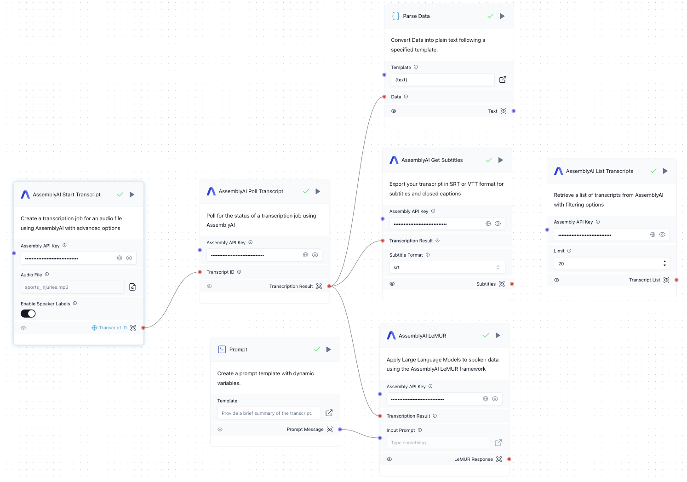

import Icon from "@site/src/components/icon";

AssemblyAI 组件允许您将强大的语音 AI 模型应用到您的应用程序中，执行以下任务：

- 转写音频和视频文件
- 格式化转写文本
- 生成字幕
- 将 LLM 应用于音频文件

有关 AssemblyAI 的更多信息：

- [官方网站](https://www.assemblyai.com/)
- [AssemblyAI API 文档](https://www.assemblyai.com/docs)
- [获取免费 API 密钥](https://www.assemblyai.com/dashboard/signup)

## 先决条件

您需要一个 **AssemblyAI API 密钥**。在创建免费账户后，您将在控制面板中找到 API 密钥。[在此获取免费 API 密钥](https://www.assemblyai.com/dashboard/signup)。

在所有需要密钥的组件中的 *AssemblyAI API Key* 字段中输入密钥。

（可选）：要使用 LeMUR，您需要升级您的 AssemblyAI 账户，因为这不包含在免费账户中。

## 组件

### AssemblyAI 开始转写

该组件允许您提交音频或视频文件进行转写。

**提示**：您可以冻结此组件的路径，只提交文件一次。

- **输入**：
    - AssemblyAI API Key：您的 API 密钥。
    - Audio File：要转写的音频或视频文件。
    - Speech Model（可选）：选择模型类别。默认为 *Best*。有关更多信息，请参阅[语音模型](https://www.assemblyai.com/docs/speech-to-text/speech-recognition#select-the-speech-model-with-best-and-nano)。
    - Automatic Language Detection（可选）：启用自动语言检测。
    - Language（可选）：音频文件的语言。如果禁用了自动语言检测，可以手动设置。
        有关支持的语言代码列表，请参阅[支持的语言](https://www.assemblyai.com/docs/getting-started/supported-languages)。
    - Enable Speaker Labels（可选）：检测音频文件中的讲话者以及每个讲话者说了什么。
    - Expected Number of Speakers（可选）：如果启用了 Speaker Labels，设置预期的讲话者数量。
    - Audio File URL（可选）：要转写的音频或视频文件的 URL。可以代替 *Audio File* 使用。
    - Punctuate（可选）：应用标点符号。默认为 true。
    - Format Text（可选）：应用大小写和文本格式。默认为 true。

- **输出**：
    - Transcript ID：转写文本的 ID

### AssemblyAI 轮询转写文本

该组件允许您轮询转写文本。它每隔几秒检查转写文本的状态，直到转写完成。

- **输入**：
    - AssemblyAI API Key：您的 API 密钥。
    - Polling Interval（可选）：轮询间隔（秒）。默认为 3。

- **输出**：
    - Transcription Result：已完成转写文本的 AssemblyAI JSON 响应。包含文本和其他信息。

### AssemblyAI 获取字幕

该组件允许您生成 SRT 或 VTT 格式的字幕。

- **输入**：
    - AssemblyAI API Key：您的 API 密钥。
    - Transcription Result：*Poll Transcript* 组件的输出。
    - Subtitle Format：字幕的格式（SRT 或 VTT）。
    - Character per Caption（可选）：每个字幕的最大字符数（0 表示无限制）。

- **输出**：
    - Subtitles：包含 `subtitles` 字段的 JSON 响应，该字段包含 SRT 或 VTT 格式的字幕。

### AssemblyAI LeMUR

该组件允许您使用 [AssemblyAI LeMUR 框架](https://www.assemblyai.com/docs/lemur)将大型语言模型应用于语音数据。

LeMUR 自动将转写文本作为额外上下文进行消化，使将 LLM 应用于音频数据变得容易。您可以将其用于摘要音频、提取洞察或提问等任务。

- **输入**：
    - AssemblyAI API Key：您的 API 密钥。
    - Transcription Result：*Poll Transcript* 组件的输出。
    - Input Prompt：用于提示模型的文本。您可以在此字段中输入您的提示，或将其连接到 *Prompt* 组件。
    - Final Model：在执行压缩后用于最终提示的模型。默认为 Claude 3.5 Sonnet。
    - Temperature（可选）：模型使用的温度。默认为 0.0。
    - Max Output Size（可选）：最大输出大小（token），最多 4000。默认为 2000。
    - Endpoint（可选）：要使用的 LeMUR 端点。默认为 "task"。对于 "summary" 和 "question-answer"，不需要提示输入。有关更多信息，请参阅 [LeMUR API 文档](https://www.assemblyai.com/docs/api-reference/lemur/)。
    - Questions（可选）：以逗号分隔的问题列表。仅在 *Endpoint* 为 "question-answer" 时使用。
    - Transcript IDs（可选）：以逗号分隔的转写文本 ID 列表。LeMUR 可以对多个转写文本执行操作。如果提供了此参数，则忽略 *Transcription Result*。

- **输出**：
    - LeMUR Response：生成的 LLM 响应。

### AssemblyAI 列出转写文本

该组件可以作为独立组件使用，用于列出所有之前生成的转写文本。

- **输入**：
    - AssemblyAI API Key：您的 API 密钥。
    - Limit（可选）：要检索的转写文本的最大数量。默认为 20，使用 0 表示全部。
    - Filter（可选）：按转写文本状态进行过滤。
    - Created On（可选）：仅获取在此日期创建的转写文本（YYYY-MM-DD）。
    - Throttled Only（可选）：仅获取被限流的转写文本，覆盖状态过滤器。

- **输出**：
    - Transcript List：所有转写文本的列表，包含转写文本 ID、状态和数据等信息。

## 流程过程

1. 用户输入音频或视频文件。
2. 用户还可以输入 LLM 提示。在这个示例中，我们希望生成转写文本的摘要。
3. 流程提交音频文件进行转写。
4. 流程每隔几秒检查转写文本的状态，直到转写完成。
5. 流程解析转写结果并输出转写的文本。
6. 流程还会生成字幕。
7. 流程应用 LLM 提示来生成摘要。
8. 作为独立组件，可以列出所有转写文本。

## 运行转写和语音 AI 流程

要运行转写和语音 AI 流程：

1. 打开 Langflow 并创建一个新项目。
2. 将上述组件添加到您的流程画布中，或下载 [AssemblyAI 转写和语音 AI 流程](./AssemblyAI_Flow.json)（下载链接）并将 JSON 文件**导入**到 Langflow 中。
3. 按照流程图中所示连接组件。**提示**：冻结 *Start Transcript* 组件的路径，只提交文件一次。
4. 在所有需要密钥的组件中输入 AssemblyAI API 密钥（Start Transcript、Poll Transcript、Get Subtitles、LeMUR、List Transcripts）。
5. 在 *Start Transcript* 组件中选择音频或视频文件。
6. 通过在 *Parse Data* 组件上单击 <Icon name="Play" aria-hidden="True" /> **运行组件**来运行流程。确保指定的模板为 `{text}`。
7. 要生成字幕，请在 *List Transcript* 组件上单击 <Icon name="Play" aria-hidden="True" /> **运行组件**。

## 自定义

可以通过以下方式自定义流程：

1. 修改 *Start Transcript* 组件中的参数。
2. 修改 *Get Subtitles* 组件中的字幕格式。
3. 修改 *LeMUR* 组件输入的 LLM 提示。
4. 修改 *LeMUR* 组件中的 LLM 参数（例如温度）。

## 故障排除

如果您遇到问题：

1. 确保在所有需要密钥的组件中正确设置了 API 密钥。
2. 要使用 LeMUR，您需要升级您的 AssemblyAI 账户，因为这不包含在免费账户中。
3. 验证所有组件在流程中都正确连接。
4. 查看 Langflow 日志以获取任何错误消息。

有关更高级的用法，请参阅 [AssemblyAI API 文档](https://www.assemblyai.com/docs/)。如果您需要更多帮助，您可以联系 [AssemblyAI 支持](https://www.assemblyai.com/contact/support)。
