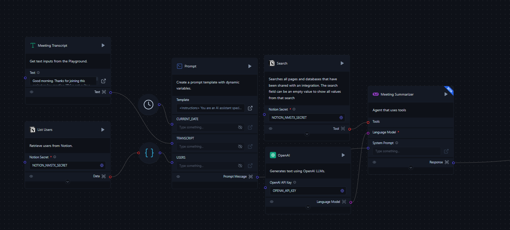
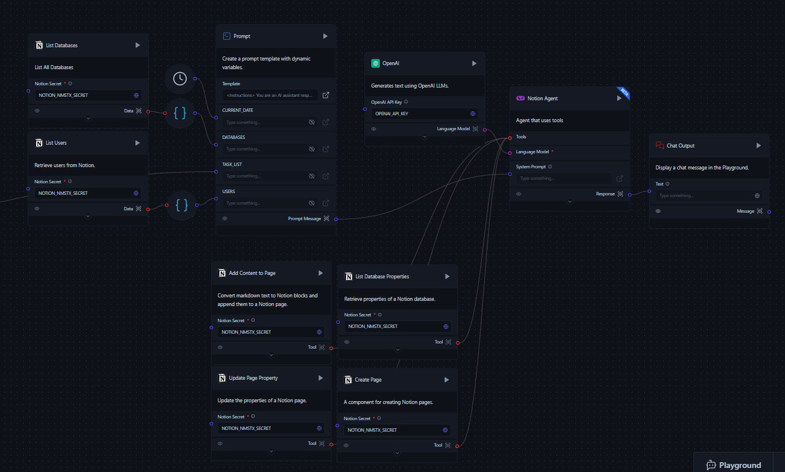

import Icon from "@site/src/components/icon";

Notion 会议记录代理是一个由 AI 驱动的工具，可以自动处理会议记录并更新您的 Notion 工作区。它可以从您的会议中识别任务、行动项和关键要点，然后在 Notion 中创建新任务或更新现有任务，无需手动输入。

## 前置条件

- [Notion 应用](/integrations/notion/setup)
- [Notion API 密钥](https://www.notion.so/my-integrations)
- [OpenAI API 密钥](https://platform.openai.com/account/api-keys)
- [下载会议代理流](./Meeting_Notes_Agent.json)（下载链接）

:::important
在使用此流程之前，请确保您已获得 Notion 和 OpenAI 的必要 API 密钥。这些密钥对于流程正常运行至关重要。请保持密钥安全，不要公开分享。
:::

## 组件

### 会议记录（文本输入）

此组件允许用户直接将会议记录输入到流程中。

### 列出用户（Notion 组件）

- **目的**：从 Notion 工作区检索用户列表。
- **输入**：Notion 密钥（API 密钥）
- **输出**：用户数据列表

### 列出数据库（Notion 组件）

- **目的**：搜索并列出 Notion 工作区中的所有数据库。
- **输入**：
  - Notion 密钥（API 密钥）
  - 查询（可选）
  - 过滤类型（默认：database）
  - 排序方向
- **输出**：数据库数据列表

### 提示

此组件使用以下输入创建动态提示模板：
- 会议记录
- 用户列表
- 数据库列表
- 当前日期

### 会议总结器（工具调用代理）

- **目的**：分析会议记录并识别任务和行动项。
- **输入**：
  - 系统提示（来自提示组件）
  - 语言模型（OpenAI）
  - 工具：
    - Notion 搜索
    - 列出数据库属性
    - 创建页面
    - 更新页面属性
    - 添加内容到页面

### Notion 代理（工具调用代理）

- **目的**：基于会议总结在 Notion 中执行操作。
- **输入**：
  - 系统提示（来自第二个提示组件）
  - 语言模型（OpenAI）
  - 工具：
    - 列出数据库属性
    - 创建页面
    - 更新页面属性
    - 添加内容到页面

### Notion 组件（工具）

#### 列出数据库属性

- **目的**：检索指定 Notion 数据库的属性。
- **输入**：
  - 数据库 ID
  - Notion 密钥（API 密钥）

#### 创建页面

- **目的**：在 Notion 数据库中创建新页面。
- **输入**：
  - 数据库 ID
  - Notion 密钥（API 密钥）
  - 属性（JSON）

#### 更新页面属性

- **目的**：更新现有 Notion 页面的属性。
- **输入**：
  - 页面 ID
  - Notion 密钥（API 密钥）
  - 要更新的属性

#### 添加内容到页面

- **目的**：将 markdown 文本转换为 Notion 块并将其附加到指定的 Notion 页面。
- **输入**：
  - 页面/块 ID
  - Notion 密钥（API 密钥）
  - Markdown 文本

### 聊天输出

在 Playground 中显示 Notion 代理的最终输出。

## 流程过程

1. 用户输入会议记录。
2. 流程检索 Notion 用户和数据库的列表。
3. 使用记录、用户列表、数据库列表和当前日期生成提示。
4. 会议总结器分析记录并识别任务和行动项。
5. Notion 代理使用会议总结来：
   - 为新任务创建新页面
   - 为现有任务更新现有页面
   - 向页面添加会议记录内容
6. 聊天输出显示在 Notion 中执行的操作摘要。

## 运行 Notion 会议记录流程

要运行 Notion 会议记录代理：

1. 打开 Langflow 并创建新项目。
2. 将上述列出的组件添加到您的流程画布中，或下载[会议代理流](./Meeting_Notes_Agent.json)（下载链接）并将 JSON 文件**导入**到 Langflow 中。
3. 按照流程图所示连接组件。
4. 在相应组件中输入 Notion 和 OpenAI API 密钥。
5. 将您的会议记录粘贴到会议记录组件中。
6. 通过点击**聊天输出**组件上的 <Icon name="Play" aria-hidden="True" /> **运行组件**来运行流程。
7. 在聊天输出组件中查看输出，它将总结在您的 Notion 工作区中执行的操作。

为获得最佳结果，请使用详细的会议记录。输出质量取决于所提供输入的全面性。

## 自定义

该流程可以根据您团队的特定需求进行自定义。

自定义此流程的方法：

1. 调整系统提示以改变代理的行为或知识库。
2. 根据您的特定需求添加或删除 Notion 工具。
3. 修改 OpenAI 模型参数（例如温度）以调整代理的响应风格。

## 故障排除

如果您遇到问题：

1. 确保所有 API 密钥都正确设置并具有必要的权限。
2. 检查您的 Notion 集成是否有权访问相关页面和数据库。
3. 验证所有组件在流程中都正确连接。
4. 查看 Langflow 日志以查找任何错误消息。

有关更高级的使用和集成选项，请参阅 [Notion API 文档](https://developers.notion.com/)和 [Langflow 文档](/)。